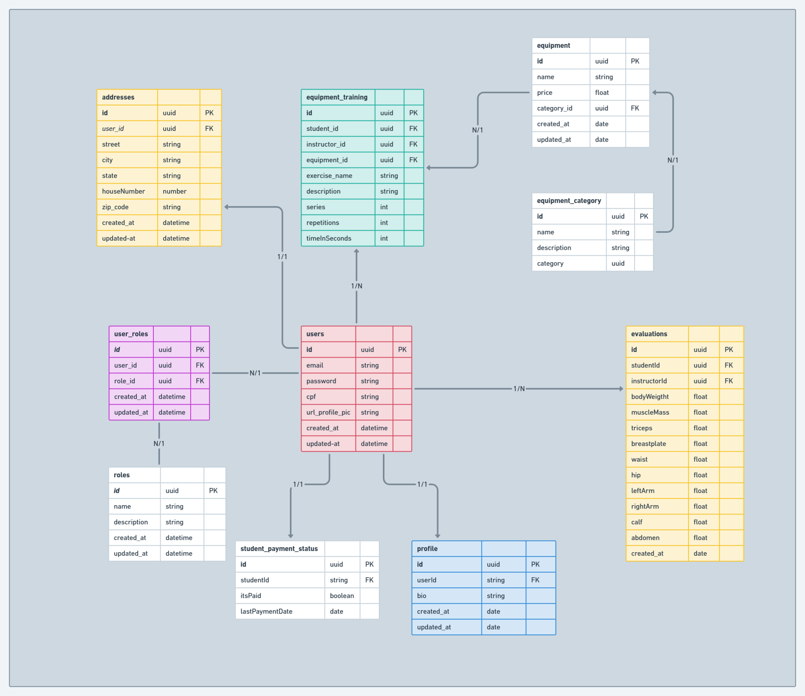

- Cadastro de Aluno
- Cadastro de instrutores
- Sistemas de pagamento: pix e cartão
- Quem tá em atraso, quem já pagou, se está em débito
- dash board pro administrador para ver que indique quem pagou e quem não pagou
- Sistema de envio de email para confirmação de pagamento, para boas vindas, uma shceduler, enviar um email de parabéns
- Área reservada para dados de avaliações
- Montar um setlist de treino da semana
- gifs dos movimentos
- Relatório de desempenho (tem que ter realizado avaliação)

# Academia

## Tecnologias

- Microserviços(Kafka? RabitMQ? Sistema de filas?)
  - Envio de Email
  - Pagamento?
- Nest Js
- React

## Arquitetura

- Clean arch
- testes automatizados

## Entidades

- Alunos
- Instrutores
- Avaliação
- Modalidade
- Treino_semanal
- ficha_de_treino

[https://apexcharts.com/](https://apexcharts.com/ 'https://apexcharts.com/')

gympass

## Funcionamento

- Terá uma tela de login para autenticação dos usuários. Que serão três tipos de usuários:
  - aluno
  - instrutor
  - admin
- Terá um fluxo de recuperação de senha
- O aluno poderá ser avaliado mensalmente por um instrutor
  - Avaliação muscular
  - Avaliação antropométrica
- Terá um dashboard para visualização da evolução do aluno em relação a avaliação muscular
- Um aluno terá uma ficha de treino semanal criada por um instrutor
- Terá um microserviço de envio de emails. Enviaremos emails quando:
  - Um novo usuário se cadastrar no sistema
  - Uma nova lista de treino for gerada pelo instrutor (será enviado um email de notificação ao aluno e ao instrutor)
  - Um aluno completar aniversário

### Requisitos não funcionais

- RNF01. O backend deve ser implementado utilizando nestjs
- RNF02. Utilizar validators
- RNF03. Utilizar Docker para manter a aplicação dentro de um container
- RNF04. O frontend deve ser implementado utilizando reactjs
- RNF05. O microserviço de envio de emails pode ser implementado utilizando nest ou express
- RNF06. Para fazer a comunicação entre o MS e o backend principal, deve ser utilizado o kafka ou RabitMQ ou Sistema de filas

### Requisitos funcionais

- RF01. Crud de students
- RF02. Listagem de todos os students(apenas para admins e instructors)
- RF03. Cadastro de equipments(apenas para admins)
- RF04. Registrar uma avaliação(instructors)
- RF05. Registrar um equipment_equipment(instructors)
- RF06. Registrar um status de pagamento de student
- RF07. Cadastro de equipment_category
- RF08. Gerar relatórios de evolução para um student com base no histórico de avaliação
- RF09. Disparar emails para novos users, recuperação de senha, avaliação realizada, pagamentos em débitos, criação de ficha de treino.

### Esquema inicial do banco de dados

</img>

### Aluno

- Informações do perfil
  - nome, endereço, telefone, pagamentos
- Avaliações
  - Avaliação muscular
    - gráfico de evolução mensal
  - Avaliação antropometrica
    - a definir...
- Ficha de treino
  - Dia da semana
    - Máquinas
      - equipamento
      - série
      - repetições
      - descrição de uso
      - gif do movimento?

### Instrutor

- Criar avaliação
  - Muscular
  - Antropometrica
- Criar ficha de treino
- Listagem de alunos

- Responsabilidade do instrutor de
  adicionar o gif ao treino

### Admin

- Listagem de Instrutores
- Listagem de Alunos
  - Status de pagamento dos alunos

Categoria

- Cadastrar categorias de equipamentos ok
- Listar categorias de equipamentos ok
- Editar categorias de equipamentos
- Exclui categorias de equipamentos

Equipamento

- Cadastrar equipamentos ok
  - Selecionar categoria
- Listagem de equipamentos
- Editar equipamentos
- Excluir equipamentos
